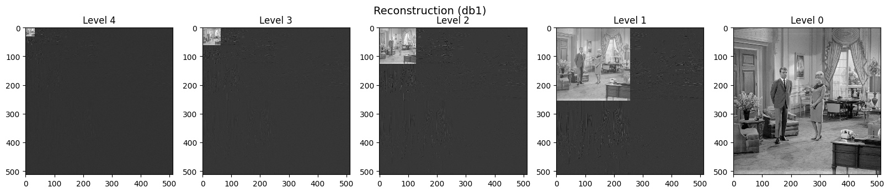
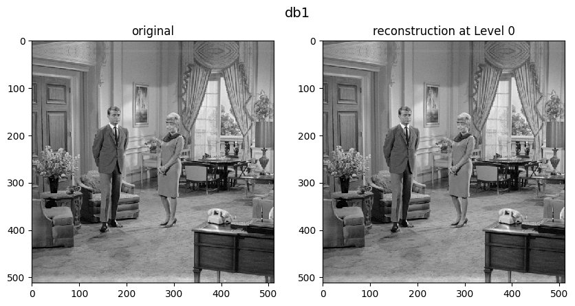
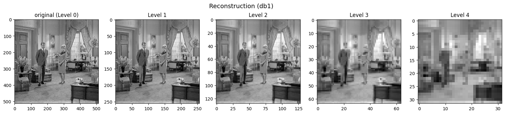

# 2D (Image) Transform
## Исходное изображение
Импортирована монохромная картинка размером 512x512.

В [notebook.ipynb](notebook.ipynb) реализован кратномасштабный анализ этого двумерного массива с возможностью выбирать тип вейвлета.

## Кратномасштабный анализ

## Реконструкция массива

## Энергия трендовой составляющей в зависимости от уровня разложения

## Пользовательские функции
- [split_matrices.py](Functions/split_matrices.py) - расчленяет исходную матрицу симметрично на 4 составляющие cA, cH, cV, cD, в соответствии со схемой PyWavelet.
- [combine_matrices.py](Functions/combine_matrices.py) - объединяет cA, cH, cV, cD в единую матрицу в соответствии со схемой PyWavelet.

[Link](https://pywavelets.readthedocs.io/en/latest/ref/2d-dwt-and-idwt.html)